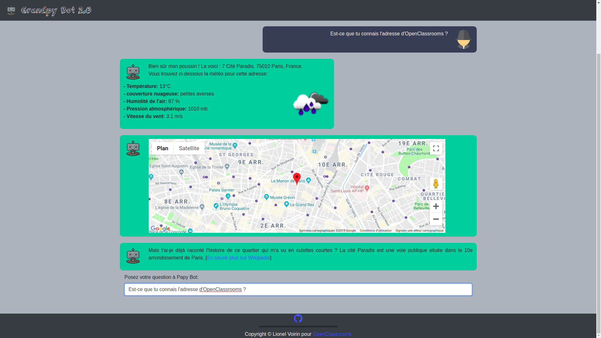

# grandpy_bot 2.0

Grandpy Bot is a Python application with the Flash framework. You can ask him about a place and he will give you his 
address with this position on Google Maps and tell you a little story about this place.

The project uses the [Google Cloud Platform APIs](https://cloud.google.com/maps-platform/) to search for address and 
display the map, while the [MediaWiki API](https://www.mediawiki.org/wiki/API:Main_page) allows Grandpy Bot to search
for information for this little story.

**Update of 09/04/2019 :**

Adding the weather of the place searched by the user. The data is
retrieved using the
[OpenWeatherMap API](https://openweathermap.org/current).

### Application responsive

This app also on Smartphone or Tablet screens as can be seen on the screenshot below:

## Start guide

### Dependencies

* [Python 3.5 or more](https://www.python.org) is required

### Installation instructions

* install Python 3.5 or more

Collect the granpy-bot repo and install the dependencies as below:

    $ git clone https://github.com/Nels885/grandpy_bot.git
    $ cd grandpy_bot
    $ pip3 install -r requirements.txt
    
You will need an account on Google Cloud Platform, then it will activate **Geocoding API** as well as 
**Maps Javascript API** and finally create a **API key** that will add in the **config.py** file which is at the root 
of the repository.
    
To start the application locally, just execute the command:

    $ python3 run.py
    
And to access the application enter **"localhost:5000"** in your web browser. All you have to do is ask your questions
to Grandpy Bot.

### screenshot of application:

